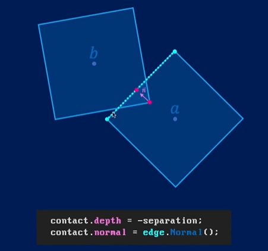
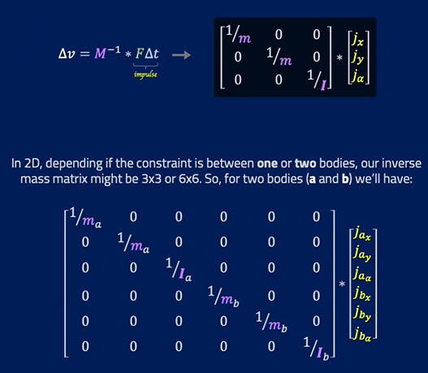

# 粒子模拟，刚体模拟，软体模拟

- 粒子模拟：模拟质子的运动属性，包括速度、加速度、位移、冲量、质量 （线性），整个模拟基本就是离散积分了
- 刚体模拟：一个粒子+一个形状 = 一个刚体，并且假设理想刚体不会形变
  - 形状则引入了转动相关的属性，角度、角速度、角质量（转动惯量）、角加速度
- 软体模拟：粒子集合+多种约束，粒子集合中的每个粒子都有自己的运动，从而产生形变

可以看 Position Based Dynamic 理论

# 刚体碰撞系统

刚体碰撞系统（分为离散和连续），整个系统大致要完成三件事


## 碰撞检测

### SAT
 
离轴定理：若存在一个轴，使得凸多边形在这个条轴上投影不相交，那么两个凸多边形一定不相交（比如，我们判断 AABB 相交时，只需要考虑 XYZ 三个轴就行了，collision = isOverlapX && isOverlapY && isOverlapZ，可以看到为了检验相交，必须确保每一条轴都重叠）


### GJK

## 碰撞响应

首先，我们需要获取检测到的碰撞信息，例如侵入深度，侵入方向，侵入起点，侵入终点等等



然后根据碰撞前后运动量的关系，求解碰撞响应，也就是要施加的冲量，包括沿着倾入方向和垂直于倾入方向（切线）的两个冲量


### 碰撞的线性响应

不考虑角转动，则刚体上的每个点的线速度都等于质心的线速度，因此碰撞点速度就是质心的速度


### 碰撞的角响应

当刚体有了转动后，碰撞点的线速度不在等于质心的速度了，下图显示了三维转动下（角速度和转动轴方向一致，二维一样的，此时 $\vec{w} =(0,0,w)$）


此时 P 点的线速度为质心速度加上转动的线速度 $\vec{V} = \vec{v} + \vec{w}\times \vec{r}$

还是同样的思路，假设碰撞需要施加冲量 $J$，计算碰撞前后碰撞点相对线速度在碰撞法向上投影的变化


对叉乘简化


### 垂直于碰撞法线的摩擦

之前的线性响应和角响应都是沿着碰撞法线的，接下来我们需要考虑沿着切线的摩擦力了


# 稳定的刚体系统

如果你完成了前面的，你会发生此时的碰撞响应是及其不稳定的，例如停不下来，闪烁，特别是多个物体堆叠后及其不稳定等等，这是十分不利于用户体验的。产生这个的原因其实就是我们目前为止只考虑了两个刚体之间的碰撞以及响应，也称 **Local Solver**。

解决的办法有引入一个 **Global Solver** 的技术来提升我们物理模拟的稳定性，通过将整个场景的所有刚体状态组成一个大矩阵方程，然后求解该矩阵方程

然而在实时物理模拟中，这种耗时操作基本不可能

## 约束运动 和 Substep Iterative

### Substep Iterative

将一段变化不是在一次迭代中直接完成，而是将变化分解成多个小变化，在多次迭代中完成

```python
sub_dt = dt / substep
for i in range(substep):
  update(sub_dt)
```

优点：

- 离散积分步长越短，误差越小
- 小变化可以为其他刚体提供喘息的机会，寻求全局解

缺点：FPS 下降

### 约束运动

#### 约束的定义

<b><font color="red">约束运动非常重要，后面软体模拟、Position Based Dynamics 也会用到</font></b>

一个约束可以用一个约束函数 $C$ 来表示，$C$ 输入是一些物体的状态，例如位置，速度，质量等等，输出一个标量

$$
C({x_1,v_1,m_1,...},{x_2,v_2,m_2,...},...{x_n,v_n,m_n,...}) \in R
$$

当约束 $C$ 处于某个范围时，我们称约束满足 **Satisfied**，我们要做的就是通过求解整个系统的全部约束方程（整个系统可能不止一个约束），来对物体进行某个操作（改变位置，施加冲量等）来让约束满足

#### 约束的分类

根据约束 $C$ 处于不同的约束满足范围时，我们可以将约束分为

- equality constraints: $C=0$，则称约束满足，这个可以通过求解线性方程。典型的有 Joint, Rope, Chains
- inequality constraints: $C>=0$，则称约束满足，这个是求解非线性方程（通过泰勒逼近，近似为线性方程）。典型的有 Penetration constraints (侵入约束)，也就是我们接下来要讨论的

当然，整个约束可以定义为

$$
when \;\; f_{c}(\vec{x})≻_{c}0, \; it \;\; satisfied
\\
solve \;\; \vec{x}
$$

其中 $≻$ 代表了 equality constraints 和 inequality constraints

另外通常每个约束都会有一些可调节的参数 $k\in[0,1]$ 来进行 smooth 或者 stiffness

#### 距离约束的速度解

假设我们有一个物体 A，其约束在运动过程中，如果处在某个位置 P，则称约束满足。那么一般情况下，我们都不会直接去改变物体 A 的位置，让其处在位置 P，而是通过求解速度，让物体 A smooth 过渡到位置 P，因此约束和速度解如下

$$
C(A,P)=|A-P|=0 \\
v+\frac{\beta}{dt}C=0
$$

当然这里求解出来的 v 是最终目标速度，你也可以用加速度来加速到目标速度，例如

$$
v = v.move\_towards(-\frac{\beta}{dt}C, \; a*dt) \\
v \; *= damping
$$

## 约束运动的冲量解

从上面可以看到，我们一般都是通过对物体施加冲量（直接改变速度）来求解约束运动，下面我们需要将施加冲量这个过程写成矩阵的形式，这里我们考虑 Local Solver，也就是两个刚体之间



我们的目标是通过约束 $C$，求出要施加的冲量 $j$。那我们可以假设约束是刚体位置和转动 $P$ 的函数，<b><font color="red">注意，刚体的位置和转动是一致的，其对时间的一阶导分别是速度和角速度，因此可以一起放在 $P$ 向量进行统一分析</font></b>。对于 equality constraints 约束函数，当满足约束时，$C=0$，那么其对时间的一阶导也等于0

$$
\dot{C} = \frac{\partial{C}}{\partial{P}}\frac{\partial{P}}{\partial{t}}=JV=0
$$

<b><font color="red">其中 J 是 Jacobian matrix（行向量）（梯度）后面我们会针对不同的约束求解这个矩阵</font></b>，$V$ 就是速度（线性速度和角速度共同组成的向量）

另外，在实际中我们会添加一个偏置项 $b$ （可控常数参数），得到 $JV+b=0$，这便是一般的速度约束解方程。

下面我们开始求解满足约束需要的冲量，我们有

$$
M\Delta{V}=j \\
M(V_2-V_1)=L\lambda
$$

其中矩阵 $M$ 就是上图的质量对角线矩阵，$V_1$是刚体当前速度，不满足约束，$V_2$是满足约束求解得到的速度，也就是 $JV_2+b=0$，$j$ 是我们要求解的要施加的冲量，$L$ 是冲量方向，$\lambda$ 是冲量振幅。

并且需要注意 $J=\frac{\partial{C}}{\partial{P}}$ 和冲量 $j$ 的关系，<b><font color="red">当我们沿着约束对于位置的梯度方向施加冲量，此时才能最优最快的使位置回到满足约束的地方，因此冲量的方向 L 可以设置为该梯度，即 L=J</font></b>，这点十分重要

下面，只需要求解冲量的振幅 $\lambda$ 即可

$$
L=J^T \\
V_2 = V_1+M^{-1}L\lambda \\
JV_2+b=0 \\
\Rightarrow
J(V_1+M^{-1}J^T\lambda)+b=0 \\
\Rightarrow
(JM^{-1}J^T)\lambda = -(JV_1+b)
$$

考虑 $\lambda$ 也是一个向量，那么整个求解最终就回到了线性方程组的 $Ax=b$ 求解，这里我们采用迭代的数值方式 **Gauss-Seidel** 求解。当然这里是标量，直接除就行

因此下面我们需要针对不同的约束，求解梯度 $J=\frac{\partial{C}}{\partial{P}}$，很多时候我们都显式的知道约束函数 $C(P)$

<b><font color="red">注意，一定要理解上面的推导，后面我们在软体模拟中也要用到</font></b>

### Joint Constraints

核心在于，初始化时需要将固定的世界坐标下的 joint point 分别在两个 rigidbody 自身局部坐标系下计算值，然后这两个值会随着 rigidbody 的运动而运动，当重新转成世界坐标后，两者重合则约束满足，因此这是一个 **equality constraint**


$\frac{dr_a}{dt}$ 用速度表示，并且有 $\dot{C}=JV$，通过一项项匹配可以得到 $J$


### 提升求解的稳定性和高效性

此时，我们得到仍是是局部解，当出现多个物体相互组成系统后，仍然不稳定，因为我们需要寻求全局解。首先看一下，目前的 `Update` 的步骤

```c++
void World::Update(float dt)
{
  // 添加力和扭矩
  for (auto body : bodies)
  {
    Vector2 wei = Force::GenerateGravityForce(*body);
    body->AddForce(wei);

    for (auto force : forces)
      body->AddForce(force);
    for (auto torque : torques)
      body->AddTorque(torque);

    body->isColliding = false;
  }

  // 先只更新速度
  for (auto body : bodies)
  {
    body->IntegrateForce(dt);
  }

  // 求解约束，施加冲量，再次更新速度
  for (size_t i = 0; i < 50; i++)
  {
    for (auto constraint : constraints)
    {
      constraint->Solve(dt);
    }
  }

  // 最后更新位置
  for (auto body : bodies)
  {
    body->IntegrateVelocity(dt);
  }

  // 碰撞检测
  CheckCollision();
};
```


解决办法一：可以通过一次 Update 中多次迭代约束求解，来得到全局解，但这大大降低了 FPS 是不可取的，下面介绍两种技巧，可以大大减少迭代次数

#### Warm Starting

我们将求解约束分成三部分，**预求解(PreSolve)**、**求解(Solve)**、**后求解(PostSolve)**

在预求解中，我们使用上一步计算的 $\lambda$，来施加冲量，也就是在求解中，我们需要缓存计算出来的 $\lambda$。因此现在变成了这样

`PreSolve` 中进行一些预计算以及施加缓存的冲量振幅

```c++
void Constraint::PreSolve(float dt)
{
  // 1. 计算梯度 J （冲量方向），J=∂C/∂P，由不同的子类实现
  // 我们只需要在 PreSolve 中计算一次，后面 Solve 多次迭代使用即可
  J = GetJ();
  lhs = J * InvM * J.Transpose();

  // 2. apply cached lambda from previous solve
  ApplyImpulse(J[0] * lambda);
};
```

在真正的 `Solve` 中需要通过累加的方式缓存 $\lambda$

```c++
void Constraint::Solve(float dt)
{
  VectorN rhs = J * GetVelocityVector() * -1.f; // MxN Nx1 = Mx1

  // 2. 计算 λ 冲量振幅
  // VectorN λ = MatrixMN::SolveGaussSeidel(lhs, rhs); // MxM Mx1 = Mx1
  // VectorN impulse = JT * λ;                         // NxM Mx1 = Nx1

  float λ = lhs[0][0] != 0.f ? rhs[0] / lhs[0][0] : 0.f; // 因为 M=1，其实就是标量，直接除就行了
  // 缓存 λ
  lambda += λ;

  // 3. 施加冲量
  ApplyImpulse(J[0] * λ);
};
```

在 `Update` 中先进行 `PreSolve >> N Solve Iterative >> PostSolve`，`N` 可以很少，例如 `3/5` 次

```c++
 // 求解约束，施加冲量，再次更新速度
for (auto constraint : constraints)
{
  constraint->PreSolve(dt);
}
for (size_t i = 0; i < constraintSolveIterations; i++)
{
  for (auto constraint : constraints)
  {
    constraint->Solve(dt);
  }
}
for (auto constraint : constraints)
{
  constraint->PostSolve(dt);
}
```

#### Adding Bias

$$
(JM^{-1}J^T)\lambda = -(JV_1+b)
$$

这里的 $b$ 就是偏置项，可以通过 $b=\frac{\beta}{\Delta{t}}C$ 来计算，用户传入的参数是 $\beta$

### Penetration Constraints

下面我们将通过 Penetration Constraints 来解决物体碰撞响应的情况了


这里图中的 $\vec{n}$ 的方法画反了，法线方向应该是从物体 a 到物体 b，可以看到此时约束是 **inequality constraints**，当约束大于等于0，两个物体才分开了

同样的，将 $\frac{dp_{a}}{dt}$ 用速度表示，并且有 $\dot{C}=JV$，通过一项项匹配可以得到 $J$


这里我们可以进一步查看 $J$ 的意义，由于法线 $\vec{n}$ 是从 a 指向 b 的，那么对 a 施加的冲量方向应该和法线相反，对 b 施加的冲量方向应该和法线相同

<b><font color="red">还有一点就是这里的 `p_a,p_b,n` 都保存在自身刚体的局部空间，然后计算的时候再转成世界坐标</font></b>

同理得到切向冲量：


同时需要现在切向冲量振幅


注意 Penetration Constraints 并没有考虑 bounciness（弹性），只是将他们分开，因此还需要进行一些修正


### 解决不稳定（例如堆叠）

其实已经发现了，目前的单一 `Contact` 做法， 当两个多边形进行碰撞响应的时候是及其不稳定的，原因在于，会出现多个碰撞点的情况，导致一边施加冲量，另一边没有施加冲量，从而左右晃动，例如下面的两种情况

|案例一|案例二|
|---|---|
|||

#### Reference and Incident Edge

首先，先定义下对于侵入方称为 `IncidentShape`，被侵入方称为 `ReferenceShape`，倾入方的点称为 `SupportPoint`（Contact 的 start 或者 end）。被倾入方的边称为 `ReferencEdge`（从那条边侵入的，法线为 Contact 的 normal），倾入方的边称为 `IncidentEdge`，从下图可以看到 `IncidentEdge` 可能是两条中的一条，那么取哪条呢？<b><font color="red">取和 `ReferencEdge` 夹角更小的那条边，代表是从 `IncidentEdge` 侵入 `ReferencEdge` 的，但是这里不能通过边的夹角来判断，需要通过边法线的夹角来判断，因为边有可能平行，但法线有朝向，通过法线的朝向可以判断边是否侵入，也就是法线的点积是负，并且越小越好，并且这种法线判断也容易推广到 3D </font><b>


找到 `ReferenceEdge` 和 `IncidentEdge` 后，用 `ReferenceEdge` 两侧的边对 `IncidentEdge` 进行裁剪，得到多个 `SupportPoint`，然后只保留侵入的 `SupportPoint`


### 解决微小抖动问题

目前为止，我们还没有解决碰撞响应结束后的微小抖动问题，这就需要让刚体 **sleeping**

- Contact Caching